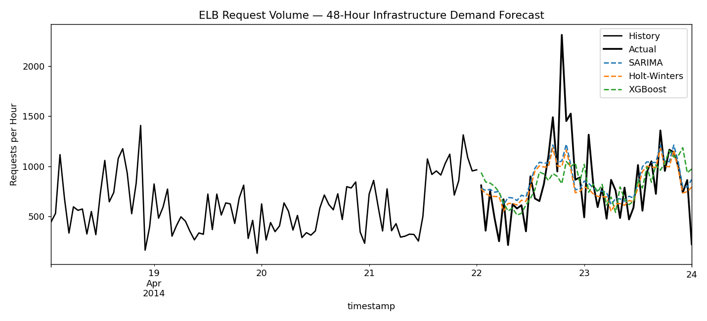

# Cloud Infrastructure Demand Forecasting

Forecasts hourly cloud infrastructure demand (AWS load-balancer request volume) 48 hours ahead,
comparing econometric time-series models against a machine-learning approach.

## Data

Real AWS CloudWatch metrics from the [NAB (Numenta Anomaly Benchmark)](https://github.com/numenta/NAB)
dataset — `realAWSCloudwatch/elb_request_count_8c0756.csv`. Two weeks of 5-minute interval
load-balancer request counts, resampled to hourly totals as the demand signal. Included directly in
this folder (`elb_request_count.csv`) since it's small.

## Method

- **SARIMA(2,1,2)(1,1,1,24)** — econometric model capturing daily seasonality
- **Holt-Winters exponential smoothing** — econometric baseline
- **XGBoost** — lag features (1–48h), rolling stats, hour/day-of-week calendar features

All three are backtested against a naive baseline on a held-out 48-hour window.

## Results

| Model | MAE | RMSE | MAPE |
|---|---|---|---|
| Naive | 322.7 | 409.0 | 60.09% |
| **Holt-Winters** | **215.6** | **307.0** | **36.48%** |
| SARIMA | 219.8 | 309.9 | 39.61% |
| XGBoost | 245.9 | 354.3 | 40.94% |

Holt-Winters performed best on this series. Feature importance showed `hour` and `day-of-week` as
the strongest predictors, confirming clear daily demand cycles in infrastructure request volume.



## Run it

```bash
pip install -r ../requirements.txt
python forecast.py
```
