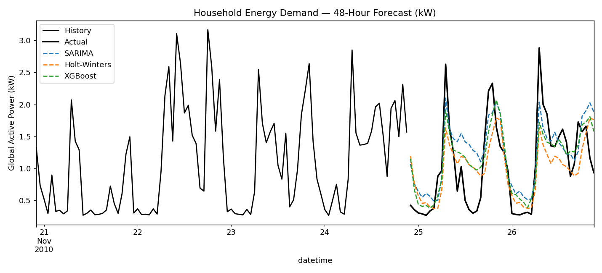

# Household Energy Demand Forecasting

Forecasts hourly household energy demand (kW) 48 hours ahead on real power consumption data.

## Data

[UCI Individual Household Electric Power Consumption](https://archive.ics.uci.edu/dataset/235/individual+household+electric+power+consumption) —
minute-level power readings for one household over ~4 years. Not included in this repo (132MB, over
GitHub's file-size limit). To reproduce:

```bash
curl -L "https://archive.ics.uci.edu/static/public/235/individual+household+electric+power+consumption.zip" -o household_power.zip
unzip household_power.zip
```

## Method

- **SARIMA(2,1,2)(1,1,1,24)** and **Holt-Winters** — econometric models with daily seasonality,
  fit on the most recent 90 days for tractability
- **XGBoost, direct multi-step** — same approach as the retail project (a separate model per
  forecast hour, trained on real historical data only)

### A real bug worth noting

After slicing the series to the most recent 90 days, the DataFrame silently lost its explicit
hourly frequency (`freq`), which made SARIMA and Holt-Winters return forecasts on a mismatched
index. This first showed up as an impossible 0.00% error metric, then a hard crash when plotting.
Fixed by explicitly re-asserting `.asfreq("h")` after every slice.

## Results

| Model | MAE | RMSE | WAPE |
|---|---|---|---|
| Seasonal-naive | 0.484 | 0.636 | 46.14% |
| Holt-Winters | 0.396 | 0.491 | 37.75% |
| SARIMA | 0.392 | 0.478 | 37.43% |
| **XGBoost (direct multi-step)** | **0.334** | **0.421** | **31.91%** |



## Run it

```bash
pip install -r ../requirements.txt
python forecast_energy.py
```
