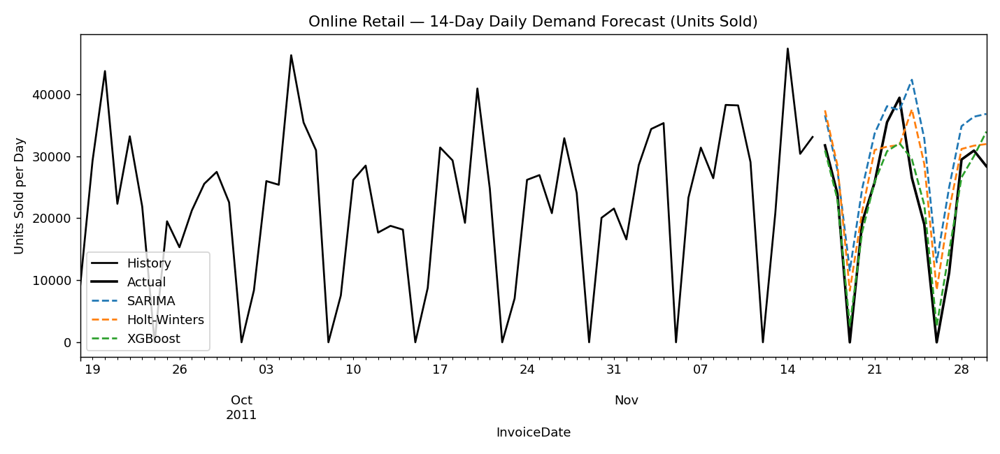

# Retail Demand Forecasting

Forecasts daily retail product demand (units sold) 14 days ahead on real e-commerce transaction data.

## Data

[UCI Online Retail II](https://archive.ics.uci.edu/dataset/502/online+retail+ii) — ~1M real
transaction records from a UK-based online wholesaler, December 2009 to December 2011. Not included
in this repo (too large for GitHub). To reproduce:

```bash
curl -L "https://archive.ics.uci.edu/static/public/502/online+retail+ii.zip" -o online_retail_ii.zip
unzip online_retail_ii.zip
python prep_data.py   # combines both sheets, cleans dtypes, writes online_retail_combined.csv
```

## Method

- **SARIMA(2,1,2)(1,1,1,7)** and **Holt-Winters** — econometric models with weekly seasonality
- **XGBoost, direct multi-step** — a separate model per forecast day (1–14), each trained on real
  historical data only

### A real bug worth noting

The business is closed on Saturdays (zero sales), which breaks standard MAPE — dividing by a
near-zero actual blows the metric up to meaningless values. Switched to **WAPE** (weighted absolute
percentage error), the standard metric for intermittent/zero-inflated demand data.

The first XGBoost attempt used **recursive** multi-step forecasting (each day's prediction feeds
into the next day's lag features) and performed *worse* than the econometric baselines — errors
compounded badly over the 14-day horizon. Switching to **direct multi-step forecasting** (one model
per horizon day, trained only on real historical values) fixed this and made XGBoost the clear
winner.

## Results

| Model | MAE | RMSE | WAPE |
|---|---|---|---|
| Seasonal-naive | 5,979.8 | 7,916.5 | 26.06% |
| Holt-Winters | 5,890.1 | 6,723.5 | 25.67% |
| SARIMA | 8,120.2 | 9,264.5 | 35.38% |
| **XGBoost (direct multi-step)** | **2,831.3** | **3,428.4** | **12.34%** |



## Run it

```bash
pip install -r ../requirements.txt
python prep_data.py
python forecast_retail.py
```
